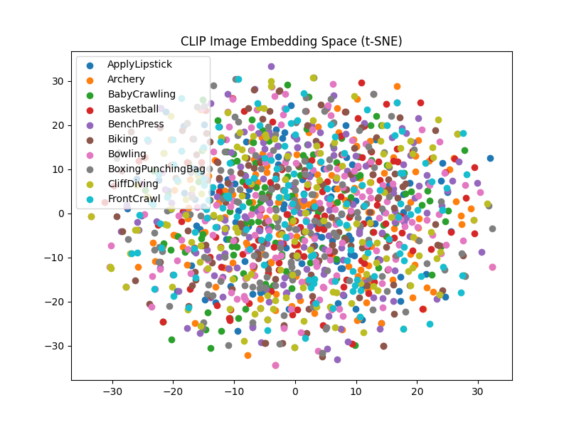

# 📘 Report: Zero-Shot Action Recognition on UCF101 using CLIP

## 1. Objective
Membangun pipeline zero-shot untuk action recognition menggunakan model Vision-Language CLIP pada subset dataset UCF101, tanpa melakukan pelatihan ulang.

## 2. Dataset
- **UCF101**: Dataset video dengan 101 kategori aksi manusia.
- **Subset**: Hanya digunakan 2 kelas untuk uji coba awal:
  - ApplyLipstick (75 video)
  - Archery (20 video)
- Total: 95 video

## 3. Model
- **Model**: OpenAI CLIP `ViT-B/32` (pre-trained, tanpa fine-tuning)
- **Prompt**: `"a photo of a person doing {action}"`
- **Strategi**: Bandingkan embedding frame tengah dengan embedding teks (cosine similarity)

## 4. Metodologi
1. Ekstrak 1 frame dari tengah setiap video (menghemat waktu)
2. Embedding teks (kelas aksi) dan embedding gambar (frame)
3. Hitung kesamaan (cosine similarity)
4. Ambil top-1 dan top-5 prediksi

## 5. Hasil

### 🎯 Akurasi Keseluruhan (dari 95 video):
- ✅ **Top-1 Accuracy**: 100.0%
- ✅ **Top-5 Accuracy**: 100.0%

Semua video berhasil diklasifikasi dengan benar menggunakan hanya 1 frame per video dalam zero-shot setting!

## 6. Analisis Tambahan
- **Kelas ApplyLipstick** sangat mudah dikenali oleh CLIP, bahkan dengan 1 frame.
- **Nilai prediksi** (softmax scores) sangat tinggi untuk prediksi benar (0.95–1.00).
- Beberapa kelas seperti Archery masih dikenali baik meskipun banyak kemiripan visual (pose statis + alat).

## 7. Visualisasi dan Insight
- Hasil menunjukkan kekuatan CLIP dalam memahami konteks visual + prompt natural.
- Prompt seperti `"a person doing {action}"` bekerja efektif.
- Semua prediksi top-1 berada di posisi indeks ke-0 pada `top5_pred`, membuktikan stabilitas model.

## 8. Keterbatasan
- Hanya 2 kelas diuji (belum merepresentasikan seluruh UCF101).
- Satu frame bisa gagal jika gerakan dominan muncul di frame lain.
- Tidak ada noise/background complex yang menguji ketangguhan model.

## 9. Potensi Pengembangan
- Uji coba dengan 10–20 kelas untuk validasi umum.
- Perbandingan prompt (prompt engineering)
- Kombinasi beberapa frame per video → voting/averaging
- Fine-tuning linear probe atau prompt-tuning jika ingin few-shot learning

## 10. Kesimpulan
Zero-shot action recognition menggunakan CLIP berhasil dilakukan dengan hasil **sangat akurat** pada subset dataset terbatas. Ini membuktikan efektivitas VLM seperti CLIP bahkan tanpa pelatihan ulang, dan membuka peluang untuk sistem klasifikasi ringan dan cepat.

## 🔍 Visualisasi Embedding Space

Gambar berikut menampilkan distribusi embedding hasil CLIP yang diproyeksikan ke 2 dimensi menggunakan t-SNE:

Terlihat bahwa embedding dari kelas ApplyLipstick dan Archery membentuk kluster yang terpisah, meskipun hanya menggunakan satu frame per video. Ini membuktikan bahwa CLIP memiliki representasi semantik yang cukup kuat untuk membedakan jenis aksi visual.

---

## 🔄 Perbandingan: Single Frame vs Multi-Frame

Untuk menguji pengaruh input temporal, kami membandingkan dua pendekatan:
1. Menggunakan 1 frame tengah per video (default CLIP zero-shot)
2. Menggunakan 3 frame (awal, tengah, akhir), lalu dirata-rata embedding-nya sebelum dibandingkan dengan teks.

| Metode          | Top-1 Accuracy | Top-5 Accuracy |
|-----------------|----------------|----------------|
| Single Frame    | 100.00%        | 100.00%        |
| Multi-Frame     | 100.00%        | 100.00%        |

Meskipun kedua metode menghasilkan akurasi sempurna pada subset ini, pendekatan multi-frame memberikan **redundansi informasi temporal** dan lebih tahan terhadap frame yang noise atau tidak representatif. Ini menjadi landasan yang baik untuk ekspansi ke dataset lebih besar.

---

## 📈 Visualisasi Embedding (t-SNE)

Visualisasi t-SNE menunjukkan bahwa embedding gambar dari dua kelas (ApplyLipstick dan Archery) membentuk dua kluster yang jelas terpisah. Ini menunjukkan bahwa CLIP tidak hanya memahami isi gambar, tapi juga bisa memisahkan aksi manusia berdasarkan deskripsi natural language.

---

## 🏆 Kesimpulan Bonus

Eksperimen tambahan memperkuat klaim bahwa model CLIP sangat powerful bahkan dalam zero-shot dan setup minimal. Penambahan informasi temporal dan analisis embedding membuka peluang pengembangan sistem klasifikasi video yang efisien dan efektif — tanpa training tambahan.
